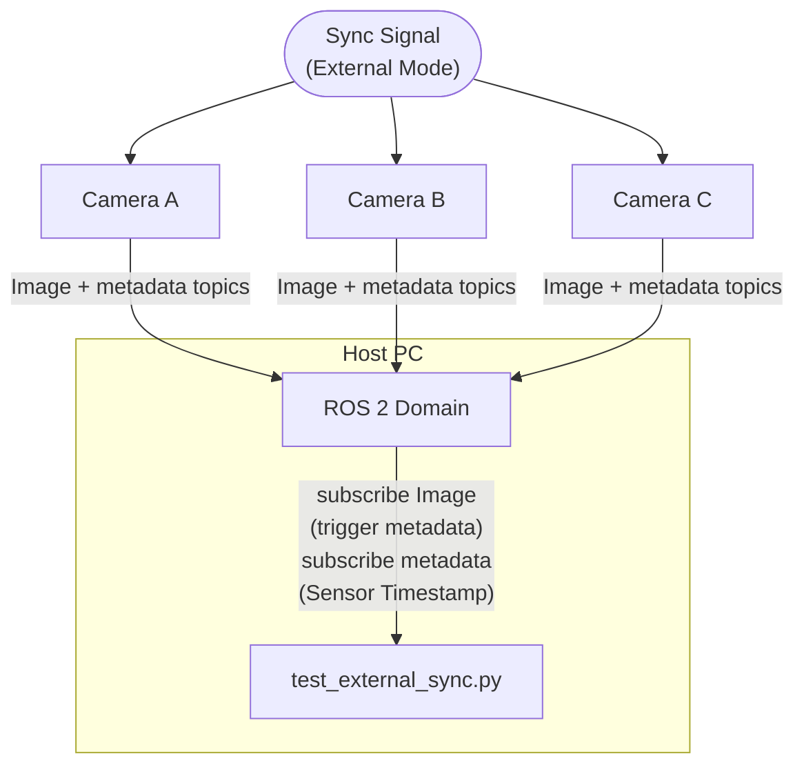
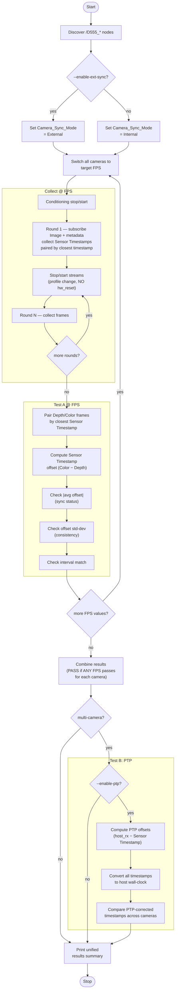
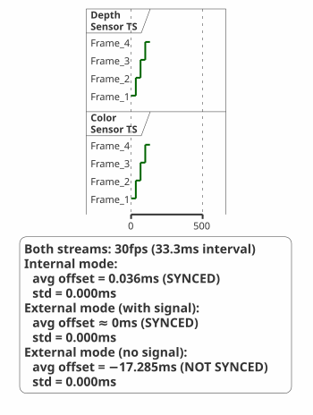
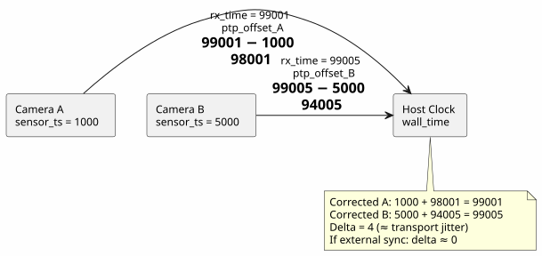
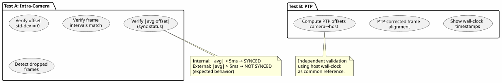

# RealSense D555e Sync Verification Tool

## Overview

This tool verifies the **frame synchronization** of Intel RealSense D555e
cameras over ROS 2.  It supports two sync modes and optional PTP
cross-validation.

| Mode                   | Description                                                                                     |
| ---------------------- | ----------------------------------------------------------------------------------------------- |
| **Internal** (default) | Camera's internal PWM master triggers both RGB and Depth sensors.  No external hardware needed. |
| **External**           | An external trigger signal synchronizes all cameras.  Used for multi-camera setups.             |

The tool performs two levels of verification:

| Test       | Scope        | What It Checks                                                                                                                                                                                                                 |
| ---------- | ------------ | ------------------------------------------------------------------------------------------------------------------------------------------------------------------------------------------------------------------------------ |
| **Test A** | Per-camera   | RGB and Depth Sensor Timestamps have constant offset, identical frame intervals, and sync status matches the expected mode.  Tests multiple FPS values (default 30, 15); sync passes if **any** FPS produces a passing result. |
| **Test B** | Multi-camera | PTP-corrected timestamps coincide for simultaneously-captured frames                                                                                                                                                           |

## Timestamp Source

**Sensor Timestamp** from the per-stream metadata topic (`std_msgs/msg/String`,
JSON format).  This is the camera firmware's sensor-level timestamp in
microseconds.

The metadata is published on topics like:
```
/realsense/D555_{serial}_{stream}/metadata     (std_msgs/String, JSON)
```

**Critical**: Metadata is only published when the corresponding Image stream
has at least one active subscriber.  The tool subscribes to **both** the Image
topic (to trigger metadata publishing) and the metadata topic (to collect
Sensor Timestamps).

Frames are paired by **closest Sensor Timestamp** — for each Depth frame,
the Color frame with the nearest Sensor Timestamp is matched (binary search,
within half a frame period).  This is robust against different DDS stream
start times and frame drops (see
[Frame Pairing](#frame-pairing-by-closest-sensor-timestamp)).

### Metadata JSON Structure

```json
{
  "header": {
    "frame-number": 42,
    "timestamp": 1705678901200000,
    "timestamp-domain": "System Time"
  },
  "stream-name": "Depth",
  "metadata": {
    "Frame Counter": 42,
    "Frame Timestamp": 1705678901200000,
    "Sensor Timestamp": 1705678901200000,
    "Actual Exposure": 8500,
    "Gain Level": 16,
    ...
  }
}
```

The key fields used by this tool:
- **`metadata.Sensor Timestamp`** — microsecond-precision sensor timestamp
- **`metadata.Frame Counter`** — monotonic frame counter (logged but not used for pairing)

## Sync Modes Explained

### Internal Sync (Default)

The camera's internal PWM master generates trigger pulses for both the Depth
and Color sensors.  Both sensors fire at the same frame rate (e.g., 30fps)
and are synchronized by the common PWM trigger.

**Expected behavior**: Sensor Timestamps for the same trigger show
a very small offset (< 1ms), confirming both sensors fire at the same
trigger pulse.

**Key indicators**:
- `|avg offset| ≈ 0 ms` (sensors are synced)
- `std-dev ≈ 0` (offset is constant)
- `interval_diff ≈ 0` (same frame rate)

### External Sync

For multi-camera setups, an external trigger signal replaces the internal PWM.
All cameras receive the same trigger pulse, so they all expose simultaneously.

The hardware configuration is **fundamentally different** from Internal mode
(see [Source Code Analysis](#source-code-analysis-internal-vs-external-mode) below):
the IPU PWM controller is disabled (`pwm_mode=0`), and both sensors are
configured to receive trigger pulses from the external STROBE input pin
(USB SBU1/2) instead of the internal `FW_GLOBAL` source.

- **With signal**: All cameras are frame-locked.  Both Depth and Color
  sensors fire on the same trigger pulse, so the intra-camera offset
  should be near zero (< 1ms), similar to Internal mode.
  Inter-camera timestamp offsets stay constant across stop/start cycles.
- **Without signal**: The PWM controller is disabled — it does **not** fall
  back to generating trigger pulses.  Both sensors free-run on their PLLs.
  Intra-camera Depth/Color offset is **large** (>10ms), confirming the
  internal sync mechanism is correctly disabled.

**Key indicators (with signal)**:
- `|avg offset| < 1ms` (SYNCED — both sensors fire on same trigger)
- `std-dev ≈ 0` (offset is perfectly constant)
- `interval_diff ≈ 0` (both streams at 30fps)

**Key indicators (without signal)**:
- `|avg offset| > 10 ms` (sensors are NOT synced — confirms external mode)
- `std-dev ≈ 0` (offset is constant because both PLLs share same oscillator)
- `interval_diff ≈ 0` (same frame rate from shared clock source)

## Architecture



## Test Flow



## Prerequisites

- **ROS 2 Humble** (or compatible)
- Python 3 with `rclpy`, `sensor_msgs`, `std_msgs`
- One or more D555e cameras visible on the ROS 2 domain
- `ROS_DOMAIN_ID` set correctly (e.g., `export ROS_DOMAIN_ID=2`)

## Usage

Run without arguments or with `--help` to see full usage information:

```bash
python3 tests/scripts/test_external_sync.py
python3 tests/scripts/test_external_sync.py --help
```

### Options

| Flag                   | Default | Description                                                                                |
| ---------------------- | ------- | ------------------------------------------------------------------------------------------ |
| `--rounds N`           | 3       | Stop/start rounds per phase                                                                |
| `--samples N`          | 30      | Frames to collect per camera per round                                                     |
| `--threshold-intra MS` | 2.0     | Max allowed offset std-dev and interval diff (ms)                                          |
| `--threshold-ptp MS`   | 2.0     | Max allowed PTP inter-camera alignment (ms)                                                |
| `--enable-ext-sync`    | off     | Set `Camera_Sync_Mode` to `External`                                                       |
| `--no-signal`          | off     | External sync **without** signal (expect NOT synced).  Use with `--enable-ext-sync`.       |
| `--hw-reset-verify`    | off     | Run Phase 2: hw_reset then verify offsets re-lock                                          |
| `--enable-ptp`         | off     | Enable PTP cross-validation (Test B)                                                       |
| `--collect-timeout S`  | 30      | Timeout for sample collection                                                              |
| `--restart-wait S`     | 5       | Wait after stream stop/start for stabilization                                             |
| `--hw-reset-wait S`    | 15      | Wait after hw_reset for camera recovery                                                    |
| `--min-cameras N`      | 0       | Minimum cameras to discover (retries with daemon restart if not met)                       |
| `--fps FPS1,FPS2,...`  | `30,15` | Comma-separated FPS values to test.  Sync passes if **any** FPS produces a passing result. |

### Examples

```bash
export ROS_DOMAIN_ID=2

# Single camera — internal sync verification (test 30 and 15 FPS)
python3 tests/scripts/test_external_sync.py --samples 60

# Single camera — test only 30 FPS
python3 tests/scripts/test_external_sync.py --samples 60 --fps 30

# Single camera — external sync without signal
python3 tests/scripts/test_external_sync.py --enable-ext-sync --no-signal --samples 60

# Multi-camera — external sync WITH signal
python3 tests/scripts/test_external_sync.py --enable-ext-sync --samples 60 \
    --min-cameras 4

# Multi-camera — external sync with 3 stop/start rounds
python3 tests/scripts/test_external_sync.py --enable-ext-sync --rounds 3

# Multi-camera — external sync + PTP cross-validation
python3 tests/scripts/test_external_sync.py --enable-ext-sync --rounds 3 \
    --enable-ptp
```

## How It Works

### Data Collection

The tool subscribes to **two** ROS 2 topics per stream:

1. **Image topic** (e.g., `/realsense/D555_{serial}_Depth`) — an
   `sensor_msgs/msg/Image` subscriber with a null callback (`lambda msg: None`).
   This subscription is necessary to **trigger** the camera firmware to
   publish metadata.  Without it, metadata topics remain silent.

2. **Metadata topic** (e.g., `/realsense/D555_{serial}_Depth/metadata`) — a
   `std_msgs/msg/String` subscriber that receives JSON-encoded metadata.
   The callback parses the JSON and extracts `Sensor Timestamp`
   (and `Frame Counter`, which is logged but not used for pairing).

Both subscriptions use **BEST_EFFORT** QoS to match the camera publisher's
QoS profile.

### Frame Pairing by Closest Sensor Timestamp

Depth and Color frames are paired by **closest Sensor Timestamp**,
not by Frame Counter, arrival order, or sorted index.  Both streams
are driven by the same trigger source (internal PWM or external signal),
so correctly paired frames have nearly identical Sensor Timestamps.

For each Depth frame (sorted by timestamp), a binary search finds the
Color frame with the nearest Sensor Timestamp.  A pair is accepted only
when the gap is within half a frame period.  Each Color frame is used
at most once (greedy, chronological order).

This approach handles:

- Arbitrary DDS stream start-time differences (even seconds apart)
- Frame drops at any point in the stream
- Mode changes and stop/start operations

> **Note**: Frame Counter is still logged in metadata but is **not used**
> for pairing.  After mode switches the Depth and Color Frame Counter
> sequences can become completely disjoint (zero common values), making
> FC-based pairing unreliable.

### Stream Stop/Start Mechanism

Stream restart is performed by **changing the profile parameter** (e.g.,
`Depth.Profile` from `z16, 896, 504, 30` to `z16, 896, 504, 15` then back,
and `CompRGB.Profile` similarly).
This restarts the stream pipeline **without resetting the camera hardware**.
The firmware clock keeps running, so timestamps continue from where they left
off.

This is different from `hw_reset`, which reboots the camera hardware and
resets the internal clock.

### Warmup Frames

After subscribing to topics, the first several frames may arrive with
stale timestamps or before DDS QoS negotiation is complete.  The tool
discards the first 5 frames per stream (configurable via `WARMUP_FRAMES`)
before recording data.  This ensures all collected samples represent
steady-state operation.

### ROS 2 Daemon Auto-Flush

Every `ros2` CLI subprocess (e.g., `ros2 param set`, `ros2 node list`)
creates a temporary DDS participant.  After many CLI calls the ROS 2
daemon's cached discovery state becomes stale, causing `ros2 node list` or
`ros2 topic list` to return incomplete or empty results.

The tool automatically restarts the daemon (stop + start) every 20 CLI calls
to prevent this.  If you encounter stale discovery issues outside the tool,
run manually:

```bash
ros2 daemon stop && sleep 1 && ros2 daemon start
```

### Test A: Intra-Camera Sync

Both sensors are driven by the same trigger source (internal PWM or external
STROBE).  Frames are paired by closest Sensor Timestamp (see
[Frame Pairing](#frame-pairing-by-closest-sensor-timestamp)), and the
**Sensor Timestamp** offset (Color − Depth) is analyzed.

The test iterates over the configured FPS values (default: **30, 15**).  For
each FPS, the tool switches all cameras to that frame rate, performs a
conditioning stop/start, collects frames, and analyzes sync.  A camera
**passes** if it is synced at **any** of the tested FPS values — this
accounts for hardware configurations where sync may only work at certain
frame rates.

The test checks three criteria:

1. **Absolute avg offset** — determines sync status:
   - **Internal mode** or **External mode (with signal)**:
     `|avg offset| < 5ms` → SYNCED → PASS.
     Both sensors fire on the same trigger pulse (internal PWM or
     external STROBE), so the Sensor Timestamp offset should be
     near zero.
   - **External mode (no signal)**: `|avg offset| > 5ms` → NOT SYNCED → PASS
     (confirms external mode correctly disengaged internal trigger)

2. **Offset consistency** — `std-dev(offset)` ≤ threshold.
   Near-zero standard deviation means every frame pair has the same offset,
   regardless of the absolute value.

3. **Interval matching** — `max|ΔDepth[i] − ΔColor[i]|` ≤ threshold.
   Both streams must step at identical intervals.



Source: [timing_diagram.puml](plantuml/timing_diagram.puml)

### Test B: PTP Cross-Validation (--enable-ptp)

#### What Is PTP?

PTP (Precision Time Protocol, IEEE 1588) aligns clocks across devices.
This tool implements a **software PTP** — it does not require hardware PTP
support.  The idea:

1. When the tool receives metadata via ROS 2, it records two times:
   - **Camera time**: `Sensor Timestamp` from metadata JSON (camera's clock)
   - **Host time**: `time.time()` at the moment of ROS callback (host clock)

2. The **PTP offset** for each camera is:
   ```
   ptp_offset = host_time − sensor_timestamp
   ```

3. Applying the PTP offset converts any camera timestamp to the host
   wall-clock domain:
   ```
   corrected_time = sensor_timestamp + ptp_offset
   ```

4. Because all cameras are compared against the **same host clock**, the
   transport latency (similar for all USB cameras on the same host) cancels
   out.

#### How It Cross-Validates

If cameras share an external trigger:
- They capture at the same instant
- Their PTP-corrected timestamps should be nearly identical
- This provides an **independent confirmation** of sync, using the host
  clock as a common reference instead of relying on camera-to-camera offsets



Source: [ptp_diagram.puml](plantuml/ptp_diagram.puml)

**Output**: The tool displays PTP-corrected timestamps from all cameras,
showing whether they actually see the same physical moment.  This is
especially useful to verify that the Sensor Timestamp-based offsets (Test A)
are real and not an artifact.

### Design Summary



Source: [design_summary.puml](plantuml/design_summary.puml)

**Verification matrix:**

| Scenario                                 | Test A (sync status)        | Test A (consistency)           | Test B (PTP)   |
| ---------------------------------------- | --------------------------- | ------------------------------ | -------------- |
| Single camera, Internal sync             | SYNCED (\|avg\| < 5ms)      | PASS (std ≈ 0)                 | N/A            |
| Single camera, External sync, no signal  | NOT SYNCED (\|avg\| > 10ms) | PASS (std ≈ 0)                 | N/A            |
| Multi-camera, Internal sync              | SYNCED per camera           | PASS per camera                | NOT synced     |
| Multi-camera, External sync, with signal | SYNCED per camera           | PASS per camera                | PASS (aligned) |
| Multi-camera, External sync, no signal   | NOT SYNCED per camera       | PASS per camera (PLL free-run) | FAIL           |

### Why Single Camera + External Sync (No Signal) Still Shows std ≈ 0

When a single camera is set to External sync mode but receives no external
trigger signal, the camera **does NOT fall back to Internal PWM mode**.
The hardware configuration remains fundamentally different from Internal mode
(see source code analysis below).  Both sensors free-run on PLLs derived from
the same on-board clock, producing identical frame rates and a constant
(but large) offset.

The absolute average offset (~17ms) confirms that Color and Depth sensors are
**not synchronized** — they fire at different moments.  But because they share
the same clock source, the offset doesn't drift (std ≈ 0).

#### Source Code Analysis: Internal vs External Mode

The CSF (Camera Sensor Framework) driver configures completely different
hardware paths for each mode:

| Parameter      | Internal (PWM Master)            | External                           |
| -------------- | -------------------------------- | ---------------------------------- |
| PWM controller | **Enabled** (`pwm_mode=1`)       | **Disabled** (`pwm_mode=0`)        |
| Trigger source | `CSF_SYNC_TRIGGER_SRC_FW_GLOBAL` | `CSF_SYNC_TRIGGER_SRC_STROBE`      |
| GPIO DO source | `SOURCE_GLOBAL_TRIGGER`          | `SOURCE_STROBE_IN_x` (rising edge) |
| Sensor regs    | `ext_vs_en=1` (0x3823=0x30)      | Same `ext_vs_en=1` (0x3823=0x30)   |

Source files:
- Depth sensor (OG02B10): `csf_og02b10_configuration.h` — `amr_og02b10_pwm_master_fsin` vs `amr_og02b10_external_vsync_fsin`
- RGB sensor (OV9782): `csf_ov9782_configuration.h` — `ov9782_pwm_master_fsin` vs `ov9782_external_vsync_fsin`
- PWM controller: `pwm.c` — `pwm_sync_config_enable()`, `pwm_global_trigger()`
- Sync mode enum: `IComponent.h` — `SyncMode::PWMMasterMode=2`, `SyncMode::External=3`

**Internal mode** (`PWMMasterMode`):
```
IPU PWM Controller (pwm_mode=1)
  │ generates periodic FW_GLOBAL trigger pulses
  ├──► GPIO DO8 ──► OV9782 (RGB)    [ext_vs_en=1, slave]
  └──► GPIO DO9 ──► OG02B10 (Depth) [ext_vs_en=1, slave]
```
Both sensors receive the same PWM-generated pulse → fire simultaneously →
Sensor Timestamp offset ≈ 0ms.

**External mode** (no signal):
```
STROBE_IN_1 pin (USB SBU1/2) ── no signal ──╳
  │ (pwm_mode=0, PWM controller disabled)
  ├──► GPIO DO8 ──► OV9782 (RGB)    [ext_vs_en=1, slave, no trigger]
  └──► GPIO DO9 ──► OG02B10 (Depth) [ext_vs_en=1, slave, no trigger]
```
Both sensors have `ext_vs_en=1` (register `0x3823=0x30`) but receive no
external VSYNC.  The OmniVision sensors **free-run on their PLLs** when
no external trigger arrives → Sensor Timestamp offset ≈ 17ms.

#### Why Free-Running PLLs Still Produce Constant Offsets (std ≈ 0)

Both sensors on the D555e board share the **same reference clock oscillator**.
Their PLLs derive timing from this common source:

- **Same frequency**: Both PLLs produce identical frame rates → frame
  intervals match (interval_diff ≈ 0).
- **No drift**: Same clock source means no frequency drift between the two
  sensors → the Color-Depth offset stays constant (std ≈ 0).
- **Large absolute offset**: The offset (~17ms) exists because the two
  sensors start free-running at different PLL initialization phases during
  boot.  This is fundamentally different from Internal mode where the PWM
  triggers both sensors simultaneously (offset ≈ 0).

#### Why Multi-Camera Fails Without Signal

The **real failure** only shows with multiple cameras (Test B): each camera
has its **own** crystal oscillator on its own PCB.  Without a shared external
trigger, each camera's sensors free-run on their own board's clock.  Different
crystals have independent PPM tolerances, so inter-camera offsets drift.

## Output

### Usage (no arguments)

Running without arguments prints usage info and exits:

```
$ python3 test_external_sync.py
============================================================
RealSense D555e Sync Verification Tool
============================================================

DESCRIPTION
  Verifies frame synchronization of Intel RealSense D555e
  cameras over ROS 2.  Uses Sensor Timestamp from metadata
  (std_msgs/String) paired by sorted index (alignment search).
  ...
```

### Internal Sync — PASS

```
============================================================
RealSense D555e Sync Verification
============================================================
  Timestamp source: Sensor Timestamp (from metadata JSON)
  Frame pairing:    Sorted index (alignment search)

[Step 1] Discovering D555e cameras ...
  Found 1 camera(s):
    /D555_343122300393

[Step 2] Setting sync mode: Internal
  [/D555_343122300393] Camera_Sync_Mode -> Internal: OK

[Step 3] Phase 1 -- Round 1/1: collecting 60 frames ...
  343122300393: depth_meta=60 color_meta=60

============================================================
ANALYSIS (sync_mode=Internal)
============================================================

[Test A] Intra-camera RGB/Depth sync (Sensor Timestamp, sorted-index pairing)
  Threshold (std-dev / interval diff): 2.0 ms
  Internal sync mode: expect Color/Depth synced (|avg offset| < 5ms)
    [343122300393] Paired frames: 60 (D=60, C=60)
    [343122300393] Sensor Timestamp offset (Color-Depth): avg=0.036ms  std=0.000ms
    [343122300393] Frame interval match: max_diff=0.000ms
    [343122300393] Sync status: SYNCED
    [343122300393] Result: [PASS]

[Test B] Inter-camera sync: SKIPPED (1 camera)

========================================================================
                    SYNC TEST RESULTS SUMMARY
========================================================================
 Test   Camera                 Metric                   Value  Result
------------------------------------------------------------------------
 A      343122300393           offset avg (abs)       0.036ms   PASS
 A      343122300393           offset std-dev         0.000ms   PASS
 A      343122300393           interval diff          0.000ms   PASS
------------------------------------------------------------------------
 OVERALL: PASS  (sync_mode=Internal)
========================================================================
```

### External Sync (no signal) — PASS (NOT SYNCED expected)

```
============================================================
RealSense D555e Sync Verification
============================================================
  Timestamp source: Sensor Timestamp (from metadata JSON)
  Frame pairing:    Sorted index (alignment search)

[Step 1] Discovering D555e cameras ...
  Found 1 camera(s):
    /D555_343122300393

[Step 2] Setting sync mode: External
  [/D555_343122300393] Camera_Sync_Mode -> External: OK

[Step 3] Phase 1 -- Round 1/1: collecting 60 frames ...
  343122300393: depth_meta=60 color_meta=60

============================================================
ANALYSIS (sync_mode=External)
============================================================

[Test A] Intra-camera RGB/Depth sync (Sensor Timestamp, sorted-index pairing)
  Threshold (std-dev / interval diff): 2.0 ms
  External sync mode: expect Color/Depth NOT synced (|avg offset| > 5ms)
    [343122300393] Paired frames: 60 (D=60, C=60)
    [343122300393] Sensor Timestamp offset (Color-Depth): avg=-17.285ms  std=0.000ms
    [343122300393] Frame interval match: max_diff=0.001ms
    [343122300393] Sync status: NOT SYNCED (expected for ext-sync without signal)
    [343122300393] Result: [PASS]

[Test B] Inter-camera sync: SKIPPED (1 camera)

========================================================================
                    SYNC TEST RESULTS SUMMARY
========================================================================
 Test   Camera                 Metric                   Value  Result
------------------------------------------------------------------------
 A      343122300393           offset avg (abs)      17.285ms   PASS
 A      343122300393           offset std-dev         0.000ms   PASS
 A      343122300393           interval diff          0.001ms   PASS
------------------------------------------------------------------------
 OVERALL: PASS  (sync_mode=External)
========================================================================
```

### Multi-Camera Internal Sync — PASS (4 cameras)

```
========================================================================
                    SYNC TEST RESULTS SUMMARY
========================================================================
 Test   Camera                 Metric                   Value  Result
------------------------------------------------------------------------
 A      338122301551           offset avg (abs)       0.036ms   PASS
 A      338122301551           offset std-dev         0.000ms   PASS
 A      338122301551           interval diff          0.000ms   PASS
 A      338122301725           offset avg (abs)       0.036ms   PASS
 A      338122301725           offset std-dev         0.000ms   PASS
 A      338122301725           interval diff          0.000ms   PASS
 A      338122303297           offset avg (abs)       0.036ms   PASS
 A      338122303297           offset std-dev         0.000ms   PASS
 A      338122303297           interval diff          0.000ms   PASS
------------------------------------------------------------------------
 OVERALL: PASS  (sync_mode=Internal)
========================================================================
```

### Multi-Camera External Sync (with signal) — PASS (4 cameras)

```
========================================================================
                    SYNC TEST RESULTS SUMMARY
========================================================================
 Test   Camera                 Metric                   Value  Result
------------------------------------------------------------------------
 A      333422301531           offset avg (abs)       0.036ms   PASS
 A      333422301531           offset std-dev         0.001ms   PASS
 A      333422301531           interval diff          0.001ms   PASS
 A      338122301551           offset avg (abs)       0.036ms   PASS
 A      338122301551           offset std-dev         0.000ms   PASS
 A      338122301551           interval diff          0.000ms   PASS
 A      338122301725           offset avg (abs)       0.036ms   PASS
 A      338122301725           offset std-dev         0.000ms   PASS
 A      338122301725           interval diff          0.001ms   PASS
 A      338122303297           offset avg (abs)       0.036ms   PASS
 A      338122303297           offset std-dev         0.000ms   PASS
 A      338122303297           interval diff          0.000ms   PASS
------------------------------------------------------------------------
 OVERALL: PASS  (sync_mode=External)
========================================================================
```

### Multi-Camera — FAIL (example)
```
========================================================================
                    SYNC TEST RESULTS SUMMARY
========================================================================
 Test   Camera                 Metric                   Value  Result
------------------------------------------------------------------------
 A      123456                 offset avg (abs)       0.050ms   PASS
 A      123456                 offset std-dev         0.001ms   PASS
 A      123456                 interval diff          0.001ms   PASS
 A      789012                 offset avg (abs)       0.048ms   PASS
 A      789012                 offset std-dev         0.001ms   PASS
 A      789012                 interval diff          0.001ms   PASS
 B      123456<->789012        PTP alignment          8.200ms   FAIL
------------------------------------------------------------------------
 OVERALL: FAIL  (sync_mode=External)
   x B: 123456<->789012 / PTP alignment = 8.200ms
========================================================================
```

## Exit Code

| Code | Meaning                |
| ---- | ---------------------- |
| 0    | All tests PASS         |
| 1    | One or more tests FAIL |

## Troubleshooting

| Symptom                                             | Possible Cause                               | Fix                                                                                                                                                                                                       |
| --------------------------------------------------- | -------------------------------------------- | --------------------------------------------------------------------------------------------------------------------------------------------------------------------------------------------------------- |
| No D555e nodes found                                | Wrong `ROS_DOMAIN_ID`                        | `export ROS_DOMAIN_ID=2`, verify `ros2 node list`                                                                                                                                                         |
| No D555e nodes found                                | DDS discovery stale                          | Use `--min-cameras N` (auto-restarts daemon), or manually: `ros2 daemon stop && ros2 daemon start`                                                                                                        |
| `ros2 node list` returns empty/partial              | Daemon cache stale after many CLI calls      | The tool auto-flushes every 20 calls.  Manually: `ros2 daemon stop && sleep 1 && ros2 daemon start`                                                                                                       |
| No Depth/Color metadata                             | Image topic not subscribed                   | Ensure Image subscription active (tool does this automatically)                                                                                                                                           |
| No Depth/Color metadata                             | Stream not active                            | Check camera is streaming: `ros2 topic hz /realsense/D555_{serial}_Depth`                                                                                                                                 |
| No Color metadata for all cameras                   | Color streams dead after many mode switches  | Restart `realsense-viewer` (firmware issue — Color/CompressedColor stops publishing after repeated mode changes)                                                                                          |
| No Color metadata for one camera                    | Camera Color stream intermittent             | The Color DDS stream on some cameras may be unreliable; retry the test                                                                                                                                    |
| Test A SKIP: "No Color metadata"                    | CompRGB stream not publishing                | Check `ros2 topic hz /realsense/D555_{serial}_CompressedColor`.  Restart camera if needed.                                                                                                                |
| Test A FAIL after mode switch                       | Mode-switching transient                     | The firmware may need time to stabilize after switching between Internal/External.  Re-run the test without changing mode.                                                                                |
| Test A FAIL: large offset in External (with signal) | Sync not working or software timestamp issue | Verify external trigger signal is connected and active.  Check firmware sensor timestamping logic.  A large offset (e.g. ~46ms) indicates the sensors are not firing simultaneously on the trigger pulse. |
| Test A FAIL: NOT SYNCED in Internal mode            | Sync hardware issue                          | Check firmware, restart camera, verify Internal mode param                                                                                                                                                |
| Test A FAIL: high std-dev                           | Frame drops or sync instability              | Check DDS/Ethernet bandwidth, try fewer `--samples`                                                                                                                                                       |
| Test B FAIL: PTP alignment off                      | No shared trigger or high network jitter     | Check sync cable; try more `--samples`                                                                                                                                                                    |
| `Camera_Sync_Mode` param fail                       | Firmware doesn't support it                  | Check with `ros2 param describe`                                                                                                                                                                          |
